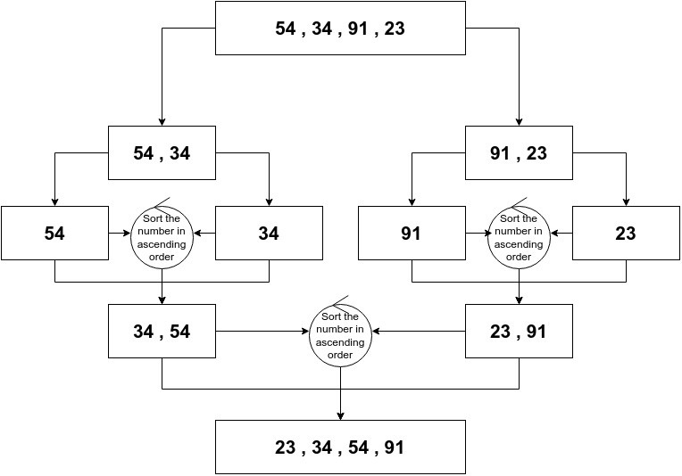

# Divide and conquer algorithms

Divide and conquer is a design strategy which is well known to breaking down efficiency barriers. When the method applies, it often leads to a large improvement in time complexity. For example,
            from O (n2) to O (n log n) to sort theelements.

# How its Done

Divide the problem instance into two or more smaller instances of the same problem, solve the smaller instances recursively,and assemble the solutions to form a solution of the original instance. The recursion stops when an instance is reached which is too small to divide. When dividing the instance, one can either use whatever division comes most easily to hand or invest
time in making the division carefully so that the assembly is simplified.

The divide-and-conquer strategy solves a problem by:
1. Breaking it into subproblems that are themselves smaller instances of the same type of
problem
2. Recursively solving these subproblems
3. Appropriately combining their answers

# Example:-

In the above figure the array of integer's is divided into equal groups, then the groups are again further divided the same way.
When the integer's are eqyally distributed , the values are compaired and sorted.
the same happens further till all the elements are sorted in increasing order.
