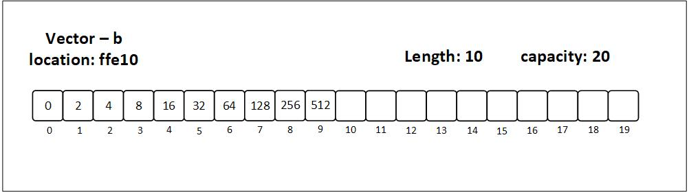

# Vector Type
Unlike arrays, a vector stores the size of the array as well. Arrays don't need to store their size. That is why we can access an array element even when we exceed the actual capacity. The boundaries are not defined.

Another thing about vectors is that they're generally stored in a heap, and they have a larger size allocated than is being used. As a result, when new values are inserted, the whole vector does not need to be relocated to fulfill the size requirements.

<p align="center">
  
  <br>
  <em>Figure 3.2.1: A vector with capacity 10 and 6 elements filled, whose capacity is about to double because it has more elements than half of its capacity: 10/ 2 < 6</em>
</p>

As with arrays, both arrays and vectors copy items into another larger array/vector once more element(s) are added; however, vectors do the copying less often as they already have more capacity than the actual length.

<p align="center">
  
  <br>
  <em>Figure 3.2.2: A vector with capacity 20 and 10 elements filled</em>
</p>

> Note: the vectors in both the figures are the same on high level, but have different names (`a` and `b`) because they are different on the low level in the sense that they have different locations in memory.
>
>
"A vector is a contiguous growable array type with heap-allocated contents."[^1]

## Initializing a vector
When initializing a primitive array, we must specify its size beforehand. However, vectors do not have such constraints. We can define the capacity of a vector manually using the `with_capacity` function.

```rust
{{#include ./vectors.rs:initialize}}
```

## Accessing and modifying a vector
Similar to the array, we can access individual elements of a vector using its index and modify them if the vector is mutable.
```rust
{{#include ./vectors.rs:access_and_modify}}
```

Now, let's delve into some of the vector specific functions that will be helpful in learning and applying algorithms.

## Vector specific functions

1. `push()`: This function inserts an element at the end of the vector
2. `pop()`: This function removes an element from the end of the vector
3. `len()`: This function outputs the number of elements in the vector

We'll be using these functions extensively. See [docs](https://doc.rust-lang.org/std/vec/struct.Vec.html) for all the functions.

## Advantages and disadvantages of vectors
| **Advantages** | **Disadvantages** |
| --- | --- |
| Dynamic size | Slower access due to indirection |
| Easy insertion and deletion | More memory usage due to extra capacity |
| Efficient use of memory | More complex implementation |
| Flexibility in size | Potential for reallocation |


## 2D vector
As with arrays, vectors are are also two dimensional. The idea of a 2D vector is the same of a [2D array](./primitive.md#2d-array).

**Initializing a 2D array**:
```rust
{{#include ./vectors.rs:2D_vector}}
```

Notice that we have initialized the type inside the fish as another vector. And inside that vector, we have specified the data type.

[^1]: <https://doc.rust-lang.org/std/vec/index.html>