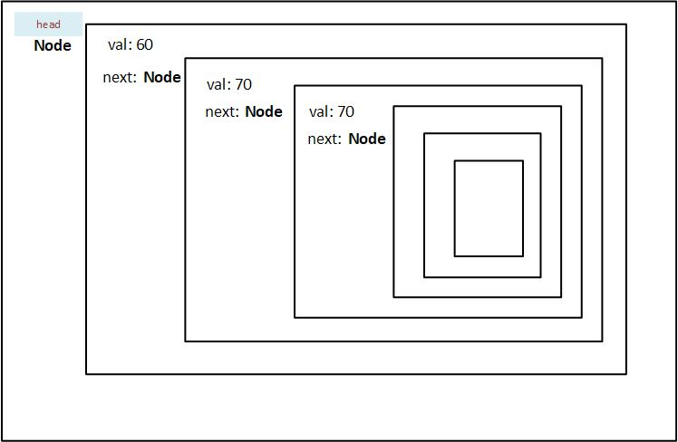

# Building a Node

As we saw in the [introduction](./linked_list.md/#linked-list), a linked list is made up of nodes that are linked to each other, or rather one node points to the next. A node consists of data and the pointer to the next node. This is what we will create first.

## How to create a Node

We'll create a struct that holds data and next Node pointer first:

```rust
struct Node {
    val: i32,
    next: Node,
}
```

After running the preceding codeblock you'll get an error saying `Node` has infinite size. What does that mean exactly?

Because, you are technically saving the value of Node inside itself, not the address. This means that node will contain its value, *and* the next node.
The next node will contain the value, *and* the node after it.

<figure>
  
  <figcaption style="text-align:center">Recursive Node</figcaption>
</figure>

As you can see from the diagram, the head node has to store all the nodes (n - 1) in it. And since we do not actually know how many nodes there are in a particular linked list, rust won't be able to assign the storage at compile time. Therefore the error presented for `Node` describes it as having infinite size.

### How to store the address of next node

To overcome the problem of infinite size, we'll have to store the address of the next Node, which can be allocated at runtime. To do that, we'll use the `Box<>` smart pointer.

```rust
struct Node {
    val: i32,
    next: Box<Node>,
}
```

Once we use a pointer, there will be no errors. We have successfully created our linked list node.

Let's initialize it:

```rust,ignore
let node = Node {
        val: 60,
        next: Box::new(Node{
            val: 70,
            next: Box::new(Node{
                val: 80,
                next:???
            })
        })
    };
```

If we try and initialze it, we'll quickly realize that there is not stop to it. By that I mean, we will always have to assign a Node to next value. This is not feasible. We need to have the option to stop.

This is where `Option` comes in. Since `next: Box<Node>`, but we want it to end, we'll need to convert the `type` of `next` to `Option`.

```rust
struct Node {
    val: i32,
    next: Option<Box<Node>>,
}
```

There we go! Did I mention making a linked list in rust is going to be compilcated?

Anyway, let's initialize it again:

```rust
let node = Node {
        val: 60,
        next: Some(Box::new(Node {
            val: 70,
            next: Some(Box::new(Node {
                val: 80,
                next: None,
            })),
        })),
    };
```

The codeblock above looks an awful lot like our diagram, but the difference is, that `next` actually stores an address in heap.
