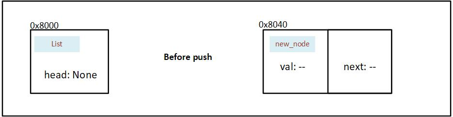
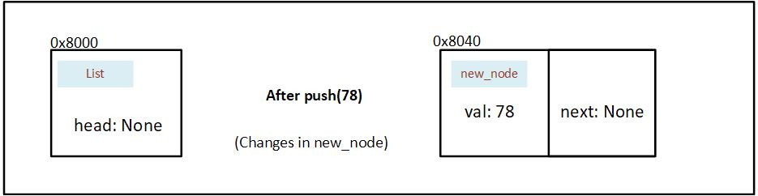
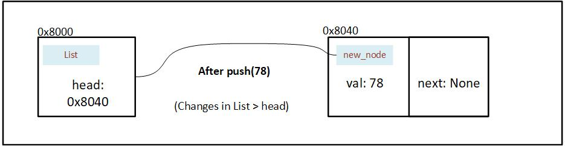
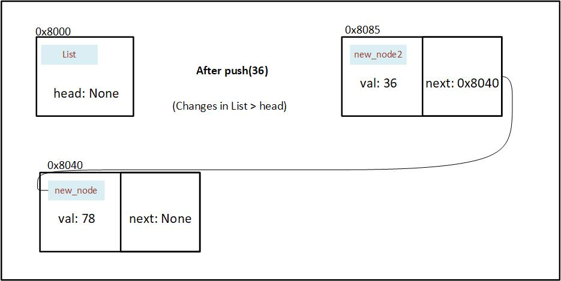
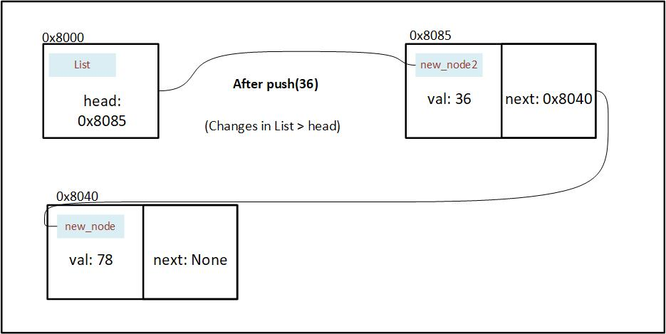

# Methods

Now that we've written our data structures, we'll also write the algorithms that will go along with it.
In rust we write the methods that go with a particular struct inside an impl. In this case it will be the `List` struct.

```rust,ignore
impl List {
    // Write the Methods that go along with List here
}
```
> Remember, since we're writing the implementation code for `List`, we'll have access to only the data structure present in the List, i.e. `head: Option<Box<i32>>`


## `new`
The first method I'd like to write is `new` which will initialize an empty List.

```rust,ignore
impl List {
{{#include ./linked_list.rs:new}}
}
```
When we call the new method on a `List`, it will initialize the `head` to point to `None`. We can scale this method to accept a new node instead of creating an empty list.

Now that we've created an empty list, we'll link the first node.

## `push`


```rust,ignore
impl List {
    {{#include ./linked_list.rs:push}}
}
```
the push method essentialyy does the following:
1. Take itself and value to be inserted as input.
2. Create a `new_node` with the inserted value as `val`.
3. It temporarily [replaces]([std::mem::replace](https://doc.rust-lang.org/std/mem/fn.replace.html)) the address in head to None, and puts the address as next.
4. It reassigns the head node to point to the `new_node`.

Let's visually see what is happening

Two things are happening in our push method:
1. A node is being created and updated
2. The head is being updated

This is before our first push operation:
We've initialized a List, but haven't yet pushed a Node into it.

<p align="center">
  
  <br>
  <em>Figure 7.2.3.1: State of memory before a Node is pushed in the initialized linked list</em>
</p>


We create a node and insert 78 as val. Using mem::replace, we also move the value in head (currently `None`) into next and insert `None` into head temporarily.
<p align="center">
  
  <br>
  <em>Figure 7.2.3.2: State of memory after a Node is initialized in the push method</em>
</p>


After the new node is created we wrap the address in a Option, and then assign it to head.
<p align="center">
  
  <br>
  <em>Figure 7.2.3.3: State of memory after address of Node is stored in the head of linked list</em>
</p>


We push one more value into the list (36). We also update next by assigning the current value of head. And replace the value in head with `None` temporarily.
<p align="center">
  
  <br>
  <em>Figure 7.2.3.4: State of memory after a new value is pushed in the linked list</em>
</p>

At last we wrap the address in our option, and insert into the head.
<p align="center">
  
  <br>
  <em>Figure 7.2.3.5: State of memory after address of new Node is stored in the head of linked list</em>
</p>


## `pop`
The pop method will be used to remove and access the last element in our linked list.
The method will take itself as input and give the removed element as an output.

> There is a possibility that the list is empty, so to represent that, we'll use `Option`.

```rust,ignore
impl List {
    {{#include ./linked_list.rs:pop}}
}
```

Alright, now that we have written a function that creates, reads, updates and deletes a list node, we'll move on to the next step of design: optimization.

Let's take a look at the code we've written so far:

```rust
{{#include ./linked_list.rs:so_far}}
