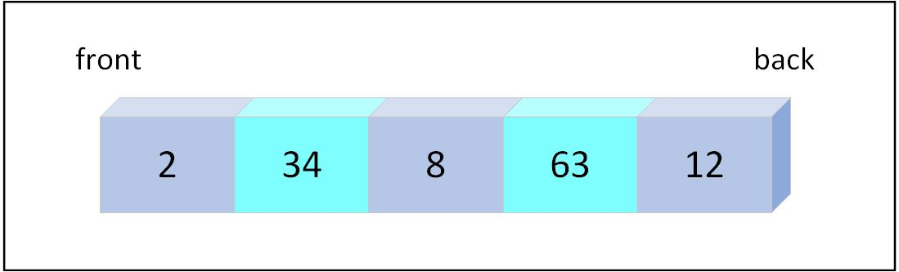

# Queue

A queue is a linear data used to model a First In First Out (FIFO) system. Conceptually, we add elements to the end of the queue and remove elements from the front.

The queue is used to model a system where the order of elements is important. For example, in a print queue, the order of jobs is important, so we use a queue to manage the jobs.

<p align="center">
  
  <br>
  <em>Figure 6.1: Visual representation of a queue</em>
</p>

In Rust, we use a `VecDeque` to implement a queue. The `VecDeque` is a double-ended queue that allows efficient insertion and removal at both ends. It is a wrapper around a `Vec` that provides additional methods for working with the queue.

## Operations

To import the `VecDeque` type, we need to add the following line at the top of our file:

```rust,ignore
{{#include ./queue.rs:imports }}
```
### Enqueue

Enqueue is the operation of adding an element to the end of the queue. The `push_back` method is used to add an element to the back of the queue.

```rust, ignore
{{#include ./queue.rs:push_back }}
```

### Dequeue

Dequeue is the operation of removing an element from the front of the queue. The `pop_front` method is used to remove an element from the front of the queue.

```rust, ignore
{{#include ./queue.rs:pop_front }}
```
### Peek

Peek is the operation of viewing the element at the front of the queue without removing it. The `front` method is used to view the element at the front of the queue.

```rust, ignore
{{#include ./queue.rs:front }}
```

## Result

```rust,editable
{{#include ./queue.rs:queue }}
```