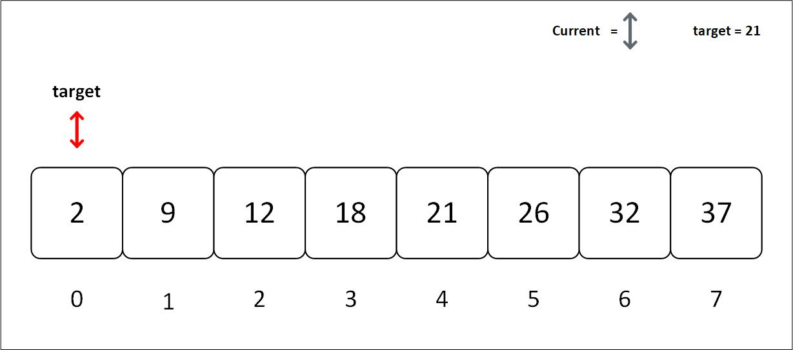
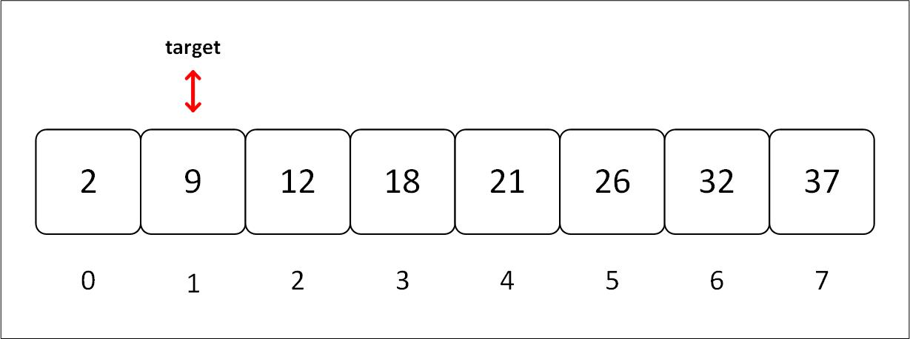
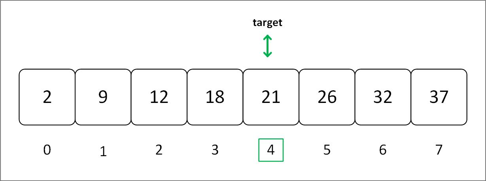

# Linear search algorithm
The most straightforward approach to searching is to examine each element of the data structure sequentially. Concurrently this searching algorithm is called linear search or sequential search.

> Imagine you're in a library, searching for a book by your favorite thriller author. You head to the thriller section and start scanning the shelves. You examine each book, one by one, until you find the one you're looking for. This process is akin to a linear search. There are a few possible outcomes: you might find the book you want, reach the end of the section without finding it, or decide to continue searching even after finding one book by the author, looking for additional titles.

## Algorithm

1. The algorithm takes the array and the token (number to be searched) as input.
2. It compares the token with every element in the array.
3. If the token and element match, the algorithm returns the index of that element.
4. If the token doesn't match with any element (i.e., it reaches the end of the array), it returns `None`.

Now let's write a function that implements the preceding steps:

```rust,ignore
{{#include ./code/algo/linear_search.rs:search_function}}
```

Here, we created a function that accepts an array and the element to be searched and gives out the Option enum.

Inside the function, a `for` loop iterates through every element in the array, that element is compared with given token for equality. If equal, the index of the element enclosed inside `Some` is returned.  When the loop iterates through the array and cannot find the token, then the function returns `None`.

Now that we have a function let's give it the inputs
```rust,ignore
{{#include ./linear_search.rs:input}}
```
Note that the by default type of both these variables is `Vec<i32>` and `i32` respectively.

By setting up the variables and the outputs in the main function

```rust
{{#include ./linear_search.rs:main}}
```
<details>
  <summary>Visualization of linear search</summary>
  
  
  
  
  
  
</details>

### Result 📦

```rust,editable
{{#include ./linear_search.rs:linear_search}}
```

## Time and Space Complexity

The time complexity of linear search is O(n), where n is the number of elements in the array. This is because in the worst case, the algorithm will have to compare the token with every element in the array.

The space complexity of linear search is O(1), as it does not require any extra space other than the input array and the token.
