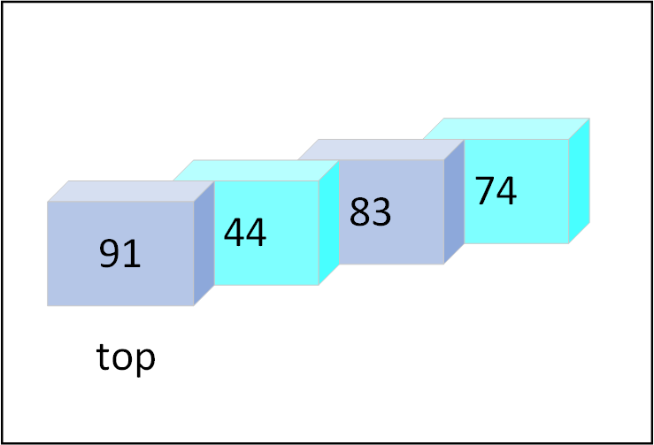

# Stack
A stack is a linear data structure that follows the principle of *Last In First Out (LIFO)*. This means that the last element inserted inside the stack is removed first.

Stacks can be visualized as a stack of plates on a table. Only the top plate is accessible by the user. The plates below cannot be accessed until they are at the top i.e., the plates above them have been removed.

The way in which we define stack in rust is the same as we define a vector. The vector data structure can be used as both an array and a stack in rust. For instance, the operations provided for vector include the operations on stack. 

## Initializing a stack.
Since we'll be using vector as a stack, we initialize it the same way.
```rust,no_run
{{#include ./../code/ds/stack.rs:initialize}}
```

Let's see the operations of stack and those functions in rust. 

## Operations on a Stack
**1. push:** Add an element to the top of a stack.

**2. pop:** Remove an element from the top of a stack.

**3. is_empty:** check if stack is empty

**4. is_full:** check if stack is full

**5. peek:** get value without removing from the stack

Let's see how to implement the two fundamental functions of a stack

```rust
{{#include ./../code/ds/stack.rs:operations}}
```
## Visual representation

There is no `is_full()` provided by Rust, but we can always create a new function.
