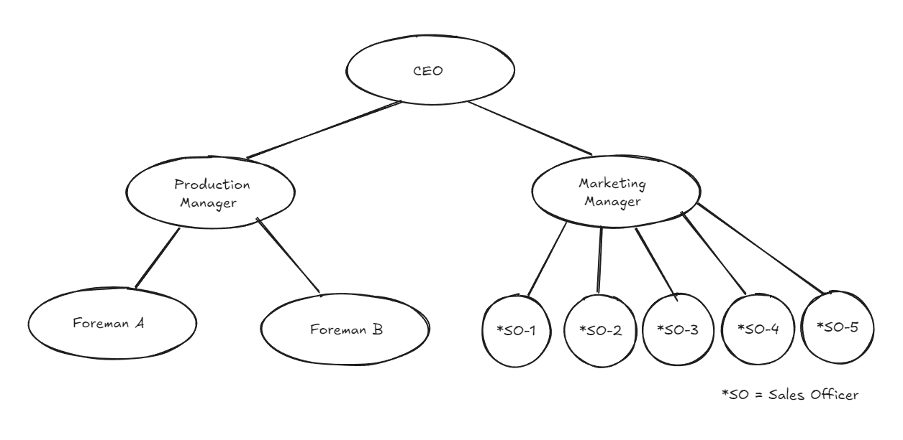
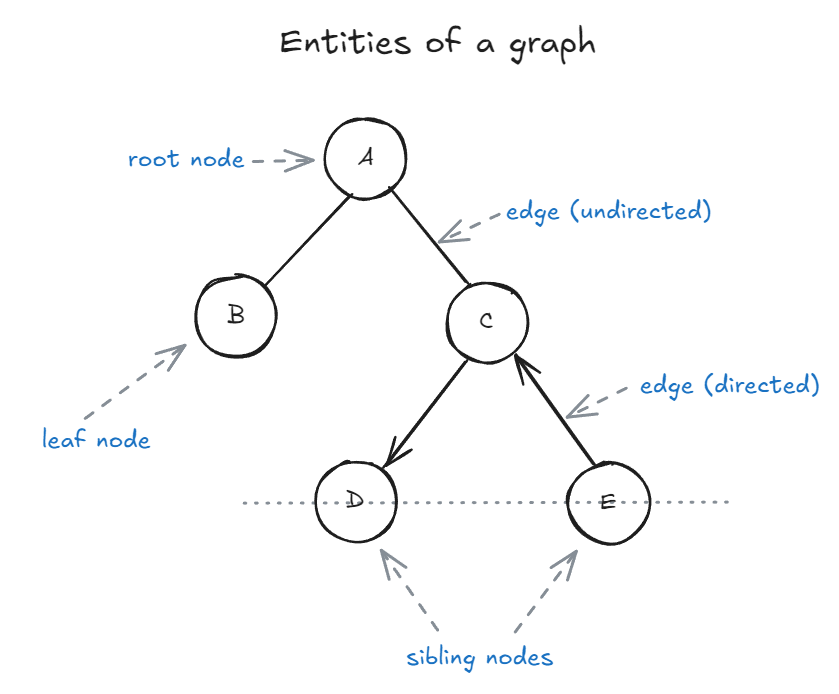

A tree is a collection of entities called 'nodes' linked together to simulate a hierarchical structure. It efficiently stores and organizes data for fast searching, insertion, and deletion.
In a real tree, root is at the bottom; in our computer science tree, root is at the top.

Trees are widely used in various applications such as databases, file systems, etc.

e.g. An employee hierarchy in an organization

## Entities of a graph:

### Nodes

Nodes are usually labelled with a data item. It is called *value*.
The node at the top of the tree is called as the *root node*.

1. Parent nodes: Nodes that link to multiple nodes on a lower level are called parent nodes. e.g. D and E are children of C.

2. Child nodes: Nodes that are linked to an upper node, that is closer to the root node, are called child nodes. In the above figure A is the parent of B and C

3. Sibling nodes: Nodes that are on the same level and share a same parent are called sibling nodes. e.g. D and E are siblings, and B and C are also sibling nodes.

4. Leaf nodes: Nodes that do not have any children nodes are called leaf nodes. They are also called terminal nodes. B, D and E are leaf nodes.

### Edges

Edges represent the connection between two nodes. Two nodes use an edge to connect or show relation between each other.
There are different types of edges, namely:

1. Undirected edges: Undirected edges are connections between two nodes where the relationship has no direction—meaning you can travel freely in both directions along the edge. If there is an undirected edge between node A and node B, you can move from A to B and from B to A without any restriction. In diagrams, undirected edges are typically represented by simple lines without arrows. While trees in computer science are usually modeled with directed edges (from parent to child), understanding undirected edges is important for grasping the fundamentals of general graphs and certain tree representations, such as undirected acyclic graphs.

2. Directed edges: Directed edges indicate a one-way relationship between two nodes, meaning you can only move from the source node to the destination node, not the other way around. In a tree, edges are typically directed from parent to child, establishing a clear hierarchy and direction of traversal. For example, if there is a directed edge from node D to node C, you can travel from D to C, but not from C back to D. Directed edges are essential in representing structures where the flow or relationship is not reciprocal, such as organizational charts, dependency trees, and certain types of graphs where direction matters.

3. Unweighted edges: Unweighted edges are connections between nodes that do not have any value or cost associated with them. In other words, all edges are considered equal, and there is no distinction in terms of distance, weight, or priority when traversing from one node to another. This is common in many tree structures, where the focus is on the relationships between nodes rather than the cost of moving between them.

4. Weighted edges: Weighted edges are connections between nodes that have an associated value, cost, or weight. This weight can represent distance, time, capacity, or any other metric relevant to the problem domain. In trees, weighted edges are often used in scenarios like representing road networks (where the weight is distance or travel time), file system hierarchies (where the weight could be file size), or decision trees (where the weight might represent probability or cost). When traversing a tree with weighted edges, algorithms can take these weights into account to find the shortest path, minimum spanning tree, or optimize other criteria based on the edge values.

## Relations

**Nodes and Edges:** If a tree has 'n' nodes, it has 'n - 1' edges.

**Depth:** Depth of some node `N` in a tree can be defined as the number of edges in path from `root` to `N`.

**Height:** Height of some node `N` is equal to the number of edges in longest path from `N` to leaf node.

## Applications
* Naturally hierarchical data
* For organizing data (for quick search, insertion, deletion).
* Trie
* Network routing
* Decision-making

## Types of Trees

1. General tree: A general tree is a tree with no constraints. It can have any number of nodes and nodes can have any number of children. A general tree is unordered.

2. Binary Tree: A binary tree is an optimized version of general tree. Every node can have either 0, 1, or 2 children. Hence it is called binary tree.

3. Binary Search Tree: A BST is just like a binary tree except with one difference; the data is ordered. The left child node is always smaller than the parent node, and the right child node is always bigger than parent node.

4. AVL tree: AVL stands for Adelson-Velsky and Landis. AVL tree is an extension of binary search tree in that it is self balancing. It refactors the heights of the left and right subtrees to be as close to each other as possible. The balancing of a tree is measured by something called the balancing factor.

In the next chapter we will learn more about Binary trees and what types of operations we can do on them.